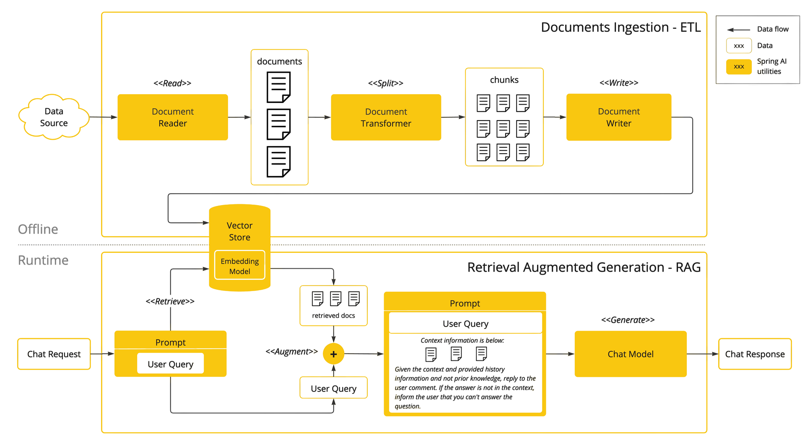

* Generative AI
  * == type of AI / 
    * can create new content (text, images, videos)
    * unique characteristics vs other AI or traditional software
      * use human language -- as the -- interface
      * reply -- based on -- context
        * != fixed rules to reply
      * pre-trained models
      * accessible -- via -- Web APIs
  * use cases
    * conversational chatbots
    * code assistance
    * healthcare diagnostics
  * requirements
    * learn about
      * retrieval-augmented generation (RAG),
      * multimodal use cases (_Examples:_ image recognition, predictive analytics) 

# Generative AI | Spring

* Spring AI
  * == Spring project / 
    * goal: integrate AI | your Spring applications
    * allows
      * creating AI-capable applications 
        * [Get started with ChatClients](https://docs.spring.io/spring-ai/reference/api/multimodality.html)
        * [Portable Chat Models](https://docs.spring.io/spring-ai/reference/api/chat/comparison.html)
  * == extension of Spring Framework| Spring ecosystem

| Generative AI challenges | Patterns / Spring AI supports -- to -- address it |
|-------------|----------|
| Align responses to goals | System prompt |
| No structured output | Output converters |
| NOT trained \| your data | Prompt Stuffing |
| Limited Context Size | RAG |
| Stateless APIs | Chat memory |
| NOT aware of your APIs | Function calling |
| Hallucinations | Evaluators |

## [Tool Calling](https://arxiv.org/abs/2302.04761)

* Tool calling
  * allows you to
    * register your own functions / connect the LLMs -- to -- external APIs 
      * -> external systems can 
        * provide LLMs with real-time data
        * perform data processing actions on their behalf
    * reference MULTIPLE functions | 1! prompt

* Spring AI
  * simplifies way to support function invocation
    * steps
      * define the function -- as a -- `@Bean`
      * if you want to activate the function -> provide the bean name | your prompt options
  * [MORE](https://docs.spring.io/spring-ai/reference/api/tools.html)

## [Model Context Protocol (MCP)](https://modelcontextprotocol.io/docs/getting-started/intro)

* | [Spring AI](https://docs.spring.io/spring-ai/reference/api/mcp/mcp-overview.html) 

## Retrieval Augmented Generation

* Retrieval Augmented Generation (RAG) 
  * incorporate relevant data | prompts
    * -> accurate AI model responses

* Spring AI
  * simplifies way to support RAG pipelines
  * [MORE](https://docs.spring.io/spring-ai/reference/api/retrieval-augmented-generation.html)

## Spring AI integration -- with -- common technologies

* how are they created?
  * build implementations | abstractions / Spring AI provides

* Spring AI
  * supported
    * major Model providers 
      * OpenAI
      * Microsoft
      * Amazon
      * Google
      * Hugging Face
    * major Vector Database providers
      * Apache Cassandra
      * Azure Vector Search
      * Chroma
      * Milvus
      * MongoDB Atlas
      * Neo4j
      * Oracle
      * PostgreSQL/PGVector
      * PineCone
      * Qdrant
      * Redis
      * Weaviate

* _Example:_ [AI Powered Flight booking system](https://github.com/tzolov/playground-flight-booking)
