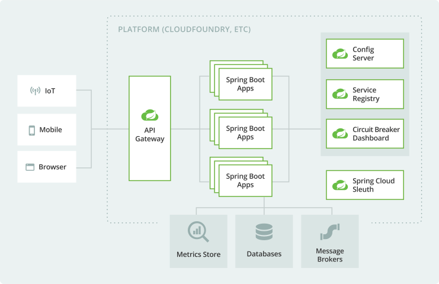

* microservices
  * == software approach /
    * application code is delivered | pieces
      * small,
      * manageable
      * independent of others
    * pros
      * easier maintenance
      * improved productivity
      * greater fault tolerance
      * better business alignment
  * use cases
    * horizontal scaling
      * Reason:  microservices are small, stateless   

* Spring
  * support building microservices
    * quickly
    * ' features
      * production grade
        * == used by Netflix, Amazon, ...
      * independent evolvable 
    * requirements
      * use Spring Cloud
      * Reason:
        * easier administration
        * boost your fault-tolerance
  * MORE
    * ["Thinking Architecturally"](https://content.pivotal.io/ebooks/thinking-architecturally)
    * [Cloud-Native Java: Designing Resilient Systems with Spring Boot, Spring Cloud, and Cloud Foundry](https://www.amazon.com/Cloud-Native-Java-Designing-Resilient/dp/1449374646)

# Microservices -- via -- Spring Boot

* Spring Boot
  * == standard for Java™ microservices
  * allows,
    * about microservices,
      * start small
      * iterate fast
        * Reason: Spring Boot’s embedded server model

# Microservice resilience -- via -- Spring Cloud

* microservices 
  * -> distributed systems -> [Spring Cloud](cloud.md)

# Build streaming data microservices -- via -- Spring Cloud Stream

* Spring Cloud Stream
  * help you 
    * build event-driven systems
      * highly scalable
      * INDEPENDENTLY of messaging platform
      * -> connects your microservices -- with -- real-time messaging 

# Manage your microservices

* -- via -- 
  * [Micrometer](https://micrometer.io)
    * == [Spring Boot’s instrumentation framework](https://docs.spring.io/spring-boot/docs/current/reference/htmlsingle/#production-ready-metrics)
      * optional 
      * sends metrics -- to -- Prometheus, Atlas, ...
  * Spring Cloud’s Sleuth & Zipkin
    * offer distributed tracing

# Microservices | [Cloud Foundry](https://www.cloudfoundry.org/)

* TAS (Tanzu Application Service) & PKS (Pivotal Kubernetes Service)
  * == Cloud Foundry's payment services
  * == platforms /
    * provide
      * scalable infrastructure
    * allows
      * reducing your administrative overhead

* [Spring Cloud Connectors](https://cloud.spring.io/spring-cloud-connectors/)
  * == library / 
    * discover & configure AUTOMATICALLY connections -- to -- cloud-hosted services
